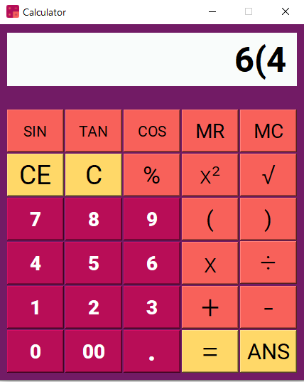
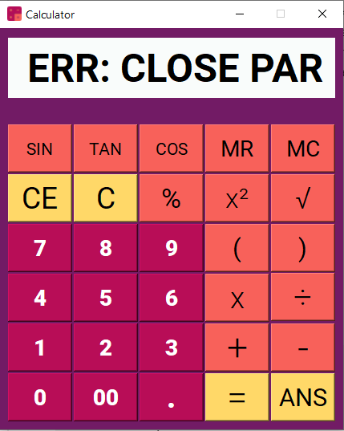

# Calculator

Pada Tugas Besar 1 Pemrograman Berorientasi Objek, kami membuat sebuah kalkulator menggunakan bahasa C++ dan toolkit Qt. Kalkulator ini dapat menerima masukan berupa angka (0-9) beserta titik (.) sebagai decimal separator. Operasi yang dapat diselesaikan oleh kalkulator ini antara lain penjumlahan (+), pengurangan (-), perkalian (x), pembagian (÷), dan akar (√). Selain itu, kalkulator ini juga dapat menggunakan operasi matematika lain seperti kurung, pemangkatan kuadrat, persen, dan fungsi trigonometri (sin, cos, tan) dalam radian. Kalkulator ini dapat menyimpan “nilai saat ini” dalam history kalkulator dengan menggunakan tombol MC, dan mengeluarkannya kembali dengan menekan tombol MR. Untuk menghapus ekspresi yang tertampil pada display saat ini, pengguna dapat menekan tombol C atau CE. Perbedaannya yaitu: tombol CE hanya menghapus ekspresi (Clear Expression) sedangkan tombol C sekaligus menghapus nilai yang tersimpan pada memori kalkulator.

## Authors

### K03-G09

* **Tony Eko Yuwono** - 13518030
* **Fikra Hadi Ramadhan** - 13518036
* **Faris Muhammad Kautsar** - 13518105
* **Gregorius Jovan Kresnadi** - 13518135

## Code Structure

```
src
└───class Calculator
└───class Parser
└───Expression
      |   class Expression
      |   class TerminalExpression
      |   class Memory
      └───Binary
      |   |   class BinaryExpression
      |   |   class AddExpression
      |   |   class DivisionExpression
      |   |   class MultiplicationExpression
      |   |   class SubtractExpression
      └───Unary
      |   └───Trigonometry
      |   |   |   class TrigonometryExpression
      |   |   |   class SinExpression
      |   |   |   class CosExpression
      |   |   |   class TanExpression
      |   |   class NegativeExpression
      |   |   class PercentExpression
      |   |   class SqrtExpression
      |   |   class SquareExpression
      |   |   class UnaryExpression
└───Exception
      |   class BaseException
      |   class DivideByZeroException
      |   class DoubleNegationException
      |   class EmptyMemoryException
      |   class EmptyParenthesesException
      |   class InvalidExpressionException
      |   class NegativeSqrtException
      |   class NullPointerException
      |   class OperationFailedException
```

## How to Compile

1. Install aplikasi Qt Creator <a href="https://www.qt.io/download-open-source?hsCtaTracking=9f6a2170-a938-42df-a8e2-a9f0b1d6cdce%7C6cb0de4f-9bb5-4778-ab02-bfb62735f3e5">di sini</a>
2. Masuk pada folder src
3. Jalankan Calculator.pro
4. Pada aplikasi Qt Creator tekan tombol Ctrl + B (Build)
5. Jalankan terminal Qt dan masuk pada folder hasil build
6. jalankan perintah ```windeployqt.exe --quick --no-translations .``` pada terminal untuk menggenerate file dll yang diperlukan Qt

## How to Run

1. Masuk pada folder bin
2. Jalankan Calculator.exe

## Screenshot




## Built With

* [C++](https://www.cplusplus.com/) - Programming language
* [Qt](https://www.qt.io/) - The GUI framework

## Etc

### Keyboard Shortcut

```
Numeric:
1, 2, 3, 4, 5, 6, 7, 8, 9, 0
. (decimal separator)

Operator:
Symbol  Shortcut
  +        +
  -        -
  ÷        /  
  x        *  
  %        %
  √        ~
  =      enter
 SIN       F1
 COS       F2
 TAN       F3
 ANS       F4
 MR        R
 MC        S
 (         (
 )         )
 C      backspace
 CE   ctrl+backspace
 ²         ^

```
